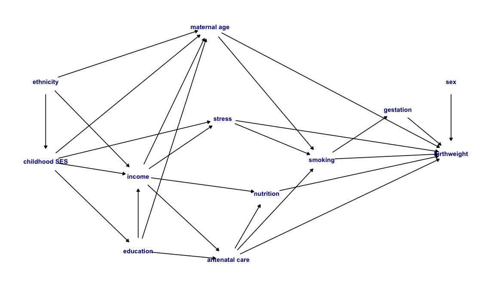
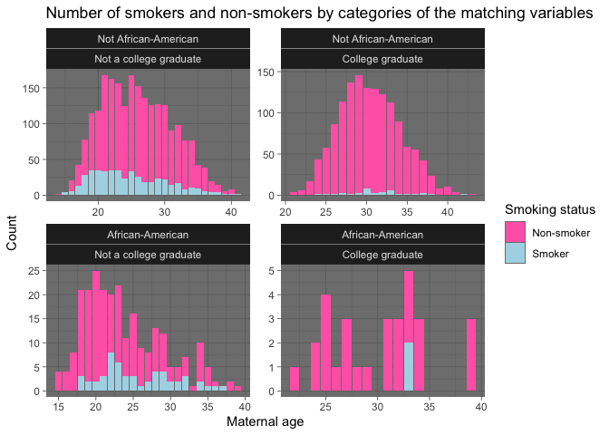
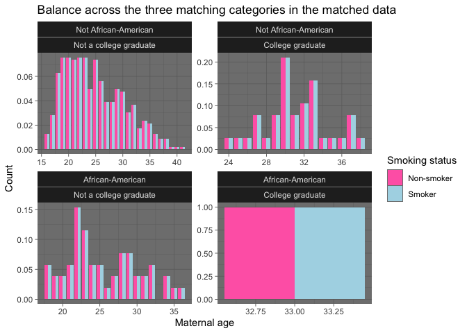

HDAT9700: Assessment 1A - Chapters 1-3
================

### Overview

In this assignment you are provided with observational data on maternal
characteristics and birth outcomes. Your aim is to estimate the total
causal effect of maternal smoking during pregnancy on birth weight.

The data come from [Abrevaya
(2006)](https://onlinelibrary.wiley.com/doi/abs/10.1002/jae.851)
*Estimating the effect of smoking on birth outcomes using a matched
panel data approach*. More details can be found
[here](http://qed.econ.queensu.ca/jae/2006-v21.4/abrevaya/readme.ja.txt).
The dataset has been restricted to mother’s first birth and **for the
purposes of this assignment can be treated as observational data
generated through a simple random sample of births**. So the emphasis in
this assignment is on drawing and understanding a DAG, implementing
matching and correctly interpreting the results, you don’t have to worry
about sample corrections (e.g. weighting) or correcting for dependency
in matched pairs.

#### Here is a brief description of the available variables:

  - **momid** identification number of the mother  
  - **idx** index number of a mother’s birth  
  - **mage** age of mother (in years)  
  - **gestat** length of gestation (in weeks)  
  - **birwt** birth weight (in grams)
  - **smoke** indicator variable for smoking status (1=smoker,
    0=nonsmoker)
  - **male** sex of the baby (1=male, 0=female)
  - **collgrad** college-graduate indicator (1=graduate, 0=non-graduate)
  - **black** indicator variable for black race (1=black, 0=white)

These data are contained in your assignment repo in the file `dt.rda`,
which can be loaded as follows:

-----

# Sample solution

## Question 1 solution

#### (1) Draw a DAG to represent the causal relationship between maternal smoking and birth weight. Write a brief descriptive paragraph that highlights any backdoor path(s) and the observed variables that might be useful to close the path(s). (25%)

*Hint: Not all variables that appear in the dataset need to be on your
DAG and not all nodes that are on your DAG will necessarily be observed
variables. You can draw your DAG using whatever tool you prefer. Options
include `ggdag()` in R, [daggity.net](http://dagitty.net/dags.html), a
screenshot from a DAG drawn in MS Word etc, or an embedded picture of a
DAG drawn with pen and paper.*

The DAG below represents my assumptions about the causal relationship
between smoking during pregnancy and birth weight. The causal model
implies that smoking affects birth weight directly (`smoking` →
`birthweight`) and indirectly throught the mediating factor length of
gestation (`smoking` → gestation → `birthweight`).

<!-- -->

There are many background factors which I theorise will affect the
likelihood of a mother smoking during pregnancy as well as the outcome
of birth weight. The number of paths on a DAG grows exponentially with
the number of nodes and edges and consequently there are a very large
number of backdoor paths implied by this DAG (there are actually 416
backdoor paths\!\!). In the interests of brevity I won’t enumerate them
all here, but below are a subset of the shorter paths.

#### Examples of pathways with `maternal age` as a parent of smoking and birth weight

  - smoking ← maternal age → birth weight
  - smoking ← maternal age ← childhood SES → stress → birth weight
  - smoking ← maternal age ← childhood SES → income → stress → birth
    weight
  - smoking ← maternal age ← income → antenatal care → nutrition → birth
    weight

#### Examples of pathways with `stress` as a parent of smoking and birth weight

  - smoking ← stress → birth weight
  - smoking ← stress ← income → nutrition → birth weight
  - smoking ← stress ← income ← ethnicity → childhood SES → education →
    antenatal care → birth weight

#### Examples of pathways with `antenatal care` as a parent of smoking and birth weight

  - smoking ← antenatal care → birth weight
  - smoking ← antenatal care → nutrition → birth weight

### Adjustment sets

Based on this DAG, the minimal adjustment set controlling for access to
antenatal care, `maternal age` and experience of stress would be
sufficient to close **all** of the backdoor paths. Controlling for these
three variables, for example by matching, would be sufficient to satisfy
the exchageability assumption and allow us to estimate the causal effect
of maternal smoking on birth weight. Of these three variables, only
maternal age is observed directly in the variable `mage`. The observed
variable `collgrad` indicates whether mothers had a third level degree,
and this can be used to help close pathways that include `education`. It
is plausible that `collgrad` could also act as a proxy for `income`,
which is not measured in the dataset. The variable `black` indicates
that the mother was an African American women, and can be used to help
close backdoor paths involving the variable `ethnicity`. Given the
social context in which the data were collected, the variable `black` is
likely to be correlated with `childhood SES`, `income` and `education`
and therefore may also help to close backdoor paths involving those
variable.

I have assumed that smoking during pregnancy will influence the length
of gestation which, in turn, will have an effect on birth weight. This
means that we would expect to see an association between gestation and
smoking status and between gestation and birth weight. However, because
gestation is a mediator, i.e. it lies on a frontdoor path between
smoking and birth weight, we do not need to control for gestation when
estimating the total effect of smoking on birth weight.

I have also assumed that birth weight will be influenced by sex of the
baby, but do not think there is a link between smoking during pregnancy
and sex of the baby. Therefore, it is not neccesary to control for sex
when estimating the total effect of smoking on birth weight.

To review, the observed variables I will match on to help close the
backdoor paths implied by my DAG are maternal age `mage`, graduation
status `collgrad`, and African American status `black`. Note that some
backdoor paths remain open, for example:

  - smoking ← stress → birth weight
  - smoking ← antenatal care → birth weight

-----

## Question 2 solution

#### (2) Match smokers to non-smokers using a matching method of your choice and matching variables that are consistent with your DAG. Briefly summarise the balance in both cases, drawing on appropriate numerical and graphical summaries. (25%)

First, I will run some exploratory analyses to compare the background
characteristics of the smoking and non-smoking groups. The table below
uses the `compareGroups` package to summarise the observed variables by
smoking status.

    ## 
    ## --------Summary descriptives table by 'smoke'---------
    ## 
    ## ____________________________________________ 
    ##                0            1      p.overall 
    ##              N=3417       N=561              
    ## ¯¯¯¯¯¯¯¯¯¯¯¯¯¯¯¯¯¯¯¯¯¯¯¯¯¯¯¯¯¯¯¯¯¯¯¯¯¯¯¯¯¯¯¯ 
    ## mage      27.7 (5.19)  25.3 (5.58)  <0.001   
    ## black:                               0.011   
    ##     0     3188 (93.3%) 506 (90.2%)           
    ##     1     229 (6.70%)  55 (9.80%)            
    ## collgrad:                           <0.001   
    ##     0     2028 (59.4%) 520 (92.7%)           
    ##     1     1389 (40.6%) 41 (7.31%)            
    ## ¯¯¯¯¯¯¯¯¯¯¯¯¯¯¯¯¯¯¯¯¯¯¯¯¯¯¯¯¯¯¯¯¯¯¯¯¯¯¯¯¯¯¯¯

In the observed data there are 561 smokers (14%) and 3,417 non-smokers
(86%). We can see that there are some marked differences in the observed
background characteristics comparing women who did and did not smoke
during pregnancy. Smoking mums were younger on average (25.3 years
versus 27.7 years), more likely to be black (9.8% versus 6.7%) and much
less likely to have attended college (7.3% versus 40.6%).

The figure below presents the number of smokers and non-smokers in each
category of the three control variable groups. This figure highlights
some sparceness in the data. For example, there are only 30
African-American college graduates in the sample, and only 2 of these
were smokers.

<!-- -->

However, it does look like there are potential exact matches for almost
all mothers who smoked, for the limited matching variables available. As
a result, I am going to proceed with **exact matching** smokers to
non-smokers on `mage` `black` and `collgrad`.

The table below provides the matching summary from this exact match: out
of 561 smokers and 3,417 non-smokers, we have matched 555 and 3,321
individuals respectively.

<table class="table table-hover table-striped" style="width: auto !important; margin-left: auto; margin-right: auto;">

<thead>

<tr>

<th style="text-align:left;">

</th>

<th style="text-align:right;">

Control

</th>

<th style="text-align:right;">

Treated

</th>

</tr>

</thead>

<tbody>

<tr>

<td style="text-align:left;">

All

</td>

<td style="text-align:right;">

3417

</td>

<td style="text-align:right;">

561

</td>

</tr>

<tr>

<td style="text-align:left;">

Matched

</td>

<td style="text-align:right;">

3321

</td>

<td style="text-align:right;">

555

</td>

</tr>

<tr>

<td style="text-align:left;">

Discarded

</td>

<td style="text-align:right;">

96

</td>

<td style="text-align:right;">

6

</td>

</tr>

</tbody>

</table>

We can visualise the proportion of respondents in each category of our
three matching variables to confirm that smokers and non-smokers are
perfectly balanced in the matched data.

<!-- -->

As summarised below, in the weighted matched data, the smokers and
non-smokers were perfectly matched with an average maternal age of 25
years, 9.7% black mothers and 7.2% college graduates.

#### Maternal age

<table class="table table-hover table-striped" style="width: auto !important; margin-left: auto; margin-right: auto;">

<thead>

<tr>

<th style="text-align:right;">

smoke

</th>

<th style="text-align:right;">

Mean

</th>

</tr>

</thead>

<tbody>

<tr>

<td style="text-align:right;">

0

</td>

<td style="text-align:right;">

25.33514

</td>

</tr>

<tr>

<td style="text-align:right;">

1

</td>

<td style="text-align:right;">

25.33514

</td>

</tr>

</tbody>

</table>

#### African-American status

<table class="table table-hover table-striped" style="width: auto !important; margin-left: auto; margin-right: auto;">

<thead>

<tr>

<th style="text-align:right;">

smoke

</th>

<th style="text-align:right;">

Mean

</th>

</tr>

</thead>

<tbody>

<tr>

<td style="text-align:right;">

0

</td>

<td style="text-align:right;">

0.0972973

</td>

</tr>

<tr>

<td style="text-align:right;">

1

</td>

<td style="text-align:right;">

0.0972973

</td>

</tr>

</tbody>

</table>

#### College graduate

<table class="table table-hover table-striped" style="width: auto !important; margin-left: auto; margin-right: auto;">

<thead>

<tr>

<th style="text-align:right;">

smoke

</th>

<th style="text-align:right;">

Mean

</th>

</tr>

</thead>

<tbody>

<tr>

<td style="text-align:right;">

0

</td>

<td style="text-align:right;">

0.0720721

</td>

</tr>

<tr>

<td style="text-align:right;">

1

</td>

<td style="text-align:right;">

0.0720721

</td>

</tr>

</tbody>

</table>

-----

## Question 3 solution

#### (3) Fit the model birwt \~ smoke in (i) The raw data and (ii) the matched data. Briefly describe the model results. How does the estimated effect for smoking change and why? (25%)

The estimated models are presented below. In the unmatched data, the
estimated effect of smoking during pregnancy on birth weight is -290g
(95% CI = -334g, -245g), i.e. babies of mothers who smoked were 290g
lighter on average. In the weighted matched data the estimated effect of
smoking during pregnancy on birth weight is -258g (95% CI = -303g,
-213g), i.e. babies of mothers who smoked were 258g lighter on average.

<table style="border-collapse:collapse; border:none;">

<caption style="font-weight: bold; text-align:left;">

Point estimates and 95% CIs for regression models of smoking on birth
weight

</caption>

<tr>

<th style="border-top: double; text-align:center; font-style:normal; font-weight:bold; padding:0.2cm;  text-align:left; ">

 

</th>

<th colspan="3" style="border-top: double; text-align:center; font-style:normal; font-weight:bold; padding:0.2cm; ">

Unmatched data

</th>

<th colspan="3" style="border-top: double; text-align:center; font-style:normal; font-weight:bold; padding:0.2cm; ">

Weighted matched data

</th>

</tr>

<tr>

<td style=" text-align:center; border-bottom:1px solid; font-style:italic; font-weight:normal;  text-align:left; ">

Predictors

</td>

<td style=" text-align:center; border-bottom:1px solid; font-style:italic; font-weight:normal;  ">

Estimates

</td>

<td style=" text-align:center; border-bottom:1px solid; font-style:italic; font-weight:normal;  ">

CI

</td>

<td style=" text-align:center; border-bottom:1px solid; font-style:italic; font-weight:normal;  ">

p

</td>

<td style=" text-align:center; border-bottom:1px solid; font-style:italic; font-weight:normal;  ">

Estimates

</td>

<td style=" text-align:center; border-bottom:1px solid; font-style:italic; font-weight:normal;  ">

CI

</td>

<td style=" text-align:center; border-bottom:1px solid; font-style:italic; font-weight:normal;  col7">

p

</td>

</tr>

<tr>

<td style=" padding:0.2cm; text-align:left; vertical-align:top; text-align:left; ">

(Intercept)

</td>

<td style=" padding:0.2cm; text-align:left; vertical-align:top; text-align:center;  ">

3478

</td>

<td style=" padding:0.2cm; text-align:left; vertical-align:top; text-align:center;  ">

3461 – 3495

</td>

<td style=" padding:0.2cm; text-align:left; vertical-align:top; text-align:center;  ">

<strong>\<0.001

</td>

<td style=" padding:0.2cm; text-align:left; vertical-align:top; text-align:center;  ">

3447

</td>

<td style=" padding:0.2cm; text-align:left; vertical-align:top; text-align:center;  ">

3430 – 3464

</td>

<td style=" padding:0.2cm; text-align:left; vertical-align:top; text-align:center;  col7">

<strong>\<0.001

</td>

</tr>

<tr>

<td style=" padding:0.2cm; text-align:left; vertical-align:top; text-align:left; ">

smoke

</td>

<td style=" padding:0.2cm; text-align:left; vertical-align:top; text-align:center;  ">

\-290

</td>

<td style=" padding:0.2cm; text-align:left; vertical-align:top; text-align:center;  ">

\-334 – -245

</td>

<td style=" padding:0.2cm; text-align:left; vertical-align:top; text-align:center;  ">

<strong>\<0.001

</td>

<td style=" padding:0.2cm; text-align:left; vertical-align:top; text-align:center;  ">

\-258

</td>

<td style=" padding:0.2cm; text-align:left; vertical-align:top; text-align:center;  ">

\-303 – -213

</td>

<td style=" padding:0.2cm; text-align:left; vertical-align:top; text-align:center;  col7">

<strong>\<0.001

</td>

</tr>

<tr>

<td style=" padding:0.2cm; text-align:left; vertical-align:top; text-align:left; padding-top:0.1cm; padding-bottom:0.1cm; border-top:1px solid;">

Observations

</td>

<td style=" padding:0.2cm; text-align:left; vertical-align:top; padding-top:0.1cm; padding-bottom:0.1cm; text-align:left; border-top:1px solid;" colspan="3">

3978

</td>

<td style=" padding:0.2cm; text-align:left; vertical-align:top; padding-top:0.1cm; padding-bottom:0.1cm; text-align:left; border-top:1px solid;" colspan="3">

3876

</td>

</tr>

</table>

The magnitude of the estimated effect of smoking is less in the matched
data compared to the unmatched data. The reason that the estimated
effect decreases is because in the matched data we have balanced
maternal age, and the proportion of Black and college-educated mothers
in the smoking and non-smoking groups. These factors confound the effect
of smoking on birth weight. By balancing these variables we have removed
their confounding effect and gotten closer to the true causal effect of
smoking on birth weight.

-----

## Question 4 Solution

#### (4) Briefly discuss any limitations of the model 3(ii) and argue whether or not the assumption of exchangeability is likely to hold. (25%)

In order to interpret the estimate of -258 (-303, -213) as the causal
effect of smoking on birth weight rather than a measure of the
association between smoking and birth weight, we must assume that the
three identifiability assumptions hold for our analysis. The
identifiability assumptions are:

1.  Positivity
2.  Exchangeability
3.  Consistency

We can consider the limitations of our model **3(ii)** with respect to
these 3 assumptions. **Positivity** assumes that the probability of
being a smoker and a non-smoker is positive in every category of the
control variables. We saw that smokers and non-smokers were not present
in all categories, particularly for Black college graduates. This limits
the generalisability of our assumptions, but we could argue that the
effects of smoking are likely to be the same among Black college
graduates as among the other groups.

**Consistency** means that everybody should get the same version of
treatment. In our case, we do not know the number of cigarettes smoked
per day, how long the mother has been smoking or if they gave up smoking
at any point during their pregnancy. This is a major limitation because
we really don’t have a consistent definition of what it means to smoke
during pregnancy.

**Exchangeability** means that smokers and non-smokers should be
balanced in terms of all of the background characteristics that affect
the likelihood of smoking during pregnancy and birth weight. The DAG
above presents several such factors which we were unable to control for,
including levels of stress and access to antenatal care. Accordingly, it
is unlikely that the assumption of exchangeability hold here.
Unsurprisingly, we can’t really be confident in interpreting the
estimates from such a simple model as casual effects.

-----
